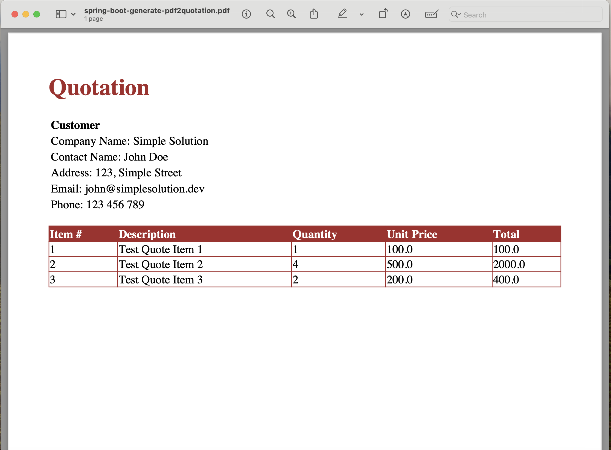

# spring-boot-generate-pdf2

A Spring Boot application that generates PDF files using OpenPDF, Flying Saucer, and Thymeleaf. The application
demonstrates PDF generation from HTML templates and database data.

## Technologies

- Spring Boot 3.5.6
- Java 21
- MySQL 9.4.0
- OpenPDF 1.3.30
- Flying Saucer PDF 9.3.1
- Thymeleaf
- Docker Compose
- Lombok
- Spring Data JPA

## Features

- Generate PDF files from HTML templates using Thymeleaf
- Create PDF reports from database data
- REST API endpoint for PDF generation
- Docker Compose integration for easy MySQL setup
- Automatic database schema creation

## Prerequisites

- Java 21 or higher
- Maven 3.6+
- Docker and Docker Compose

## Database Configuration

The application uses MySQL 9.4.0 with the following credentials (defined in `compose.yaml`):

- **Database**: employee
- **Username**: yu71
- **Password**: 53cret
- **Port**: 3306

## Getting Started

### 1. Clone the repository

```bash
git clone https://github.com/hendisantika/spring-boot-generate-pdf2.git
cd spring-boot-generate-pdf2
```

### 2. Start MySQL using Docker Compose

The application uses Spring Boot Docker Compose support, which automatically starts the MySQL container when you run the
application.

To manually start MySQL:

```bash
docker compose up -d
```

To check the MySQL container status:

```bash
docker compose ps
```

To stop MySQL:

```bash
docker compose down
```

To stop MySQL and remove volumes (delete all data):

```bash
docker compose down -v
```

### 3. Build the application

```bash
mvn clean package
```

### 4. Run the application

```bash
mvn spring-boot:run
```

The application will:

- Automatically start the MySQL container (if not already running)
- Connect to the MySQL database
- Create the `employee` table automatically
- Generate a sample PDF report on startup
- Start the web server on port 8080

## API Endpoints

### Generate PDF

**Endpoint**: `GET /pdf/generate`

**Description**: Generates a PDF file and downloads it directly to the browser.

**Example**:

```bash
curl -O http://localhost:8080/pdf/generate
```

Or open in your browser:

```
http://localhost:8080/pdf/generate
```

## Project Structure

```
spring-boot-generate-pdf2/
├── src/
│   ├── main/
│   │   ├── java/
│   │   │   └── id/my/hendisantika/springbootgeneratepdf2/
│   │   │       ├── config/          # Thymeleaf configuration
│   │   │       ├── controller/      # REST controllers
│   │   │       ├── entity/          # JPA entities
│   │   │       ├── repository/      # Spring Data repositories
│   │   │       ├── service/         # Business logic
│   │   │       └── util/            # PDF generation utilities
│   │   └── resources/
│   │       ├── application.properties
│   │       └── templates/           # Thymeleaf templates
│   └── test/
├── compose.yaml                     # Docker Compose configuration
├── pom.xml
└── README.md
```

## Configuration

The main configuration is in `src/main/resources/application.properties`:

```properties
# Database Configuration
spring.datasource.url=jdbc:mysql://localhost:3306/employee
spring.datasource.username=yu71
spring.datasource.password=53cret
# PDF Generation
pdfDir=output/
reportFileName=Employee-Report
reportFileNameDateFormat=dd_MMMM_yyyy
```

## Output

Generated PDF files will be saved in the `output/` directory in the project root.

## Docker Compose Configuration

The `compose.yaml` file defines the MySQL service:

```yaml
services:
  mysql:
    image: 'mysql:9.4.0'
    environment:
      MYSQL_ROOT_PASSWORD: 53cret
      MYSQL_USER: yu71
      MYSQL_PASSWORD: 53cret
      MYSQL_DATABASE: employee
    ports:
      - '3306:3306'
```

## Troubleshooting

### MySQL Connection Issues

If you encounter database connection issues:

1. Ensure Docker is running
2. Check if the MySQL container is healthy:
   ```bash
   docker compose ps
   ```
3. View MySQL logs:
   ```bash
   docker compose logs mysql
   ```

### Port Already in Use

If port 3306 or 8080 is already in use:

- For MySQL: Change the port mapping in `compose.yaml`
- For Spring Boot: Add `server.port=8081` to `application.properties`

### Clean Start

To start fresh with a clean database:

```bash
docker compose down -v
mvn clean
mvn spring-boot:run
```

## Image Screenshot

Quotation PDF



## License

This project is licensed under the MIT License.

## Author

hendisantika

- GitHub: [@hendisantika](https://github.com/hendisantika)
- Email: hendisantika@gmail.com
- Telegram: @hendisantika34
